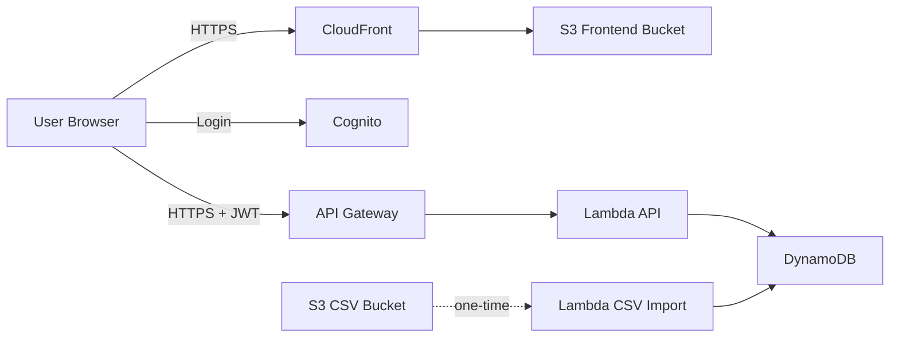

# NY GHG Dashboard - End-to-End Flow and TODO

## 1) Project Goal

Build a role-based New York State GHG visualization platform with:

- Login and role-based access (`Super Admin`, `Data Owner`)
- NY regional council map (REDC regions)
- Council-level emissions dashboard (year filter + pie + trend)
- Data entry for future actuals (`2026-2030`)
- Actual vs Forecast comparison without overwriting forecast baseline

---

## 2) Current Frontend Stack (Implemented)

- React + Vite + TypeScript
- Routing: `react-router-dom`
- Map: `leaflet`, `react-leaflet`
- Charts: `chart.js`, `react-chartjs-2`
- Local mock persistence: browser `localStorage`

---

## 3) Current UI and Feature Flow

## 3.1 Login and Access

- Login page supports only:
  - `Vijay` -> `Super Admin` (all regions)
  - `Ajith` -> `Data Owner` (Long Island only)
- Password is required (mock validation in UI)
- Header shows:
  - SuperAdmin status badge (green/red)
  - Assigned region chip

## 3.2 Map Page

- New York county boundary map grouped into 10 REDC regions
- Region names shown on the map
- Regional total scorecards by selected year
- Always-visible overall NY trend chart below scorecards

## 3.3 Region Detail Page

- Total GHG KPI for selected region/year
- Pie chart with sectors:
  - Transport, Buildings, Power, Waste, Industry, Agriculture
- Line chart with two lines:
  - Actual
  - Forecast
- Units formatted as `x.x Million tCO2e` in trend chart axis and tooltip

## 3.4 Data Entry Page

- Data entry is restricted to years `2026-2030` only
- Historical period (`<= 2025`) is not editable
- Save action writes submitted values as `actual` for that year
- Existing `forecast` values remain unchanged for comparison

---

## 4) Data Behavior Rules

- Forecast data is the baseline
- Future actual submissions do not overwrite forecast
- Trend chart shows both series together for variance analysis
- For display where both exist for same year:
  - Actual is preferred for single-value views
  - Trend charts render both lines separately

---

## 5) Proposed AWS Architecture (Cost-Effective)

- Frontend hosting: `S3 + CloudFront`
- Authentication/authorization: `Amazon Cognito`
- API layer: `API Gateway`
- Business logic: `AWS Lambda`
- Database: `DynamoDB`
- One-time CSV ingestion:
  - Upload CSV to S3
  - Trigger/import Lambda once
  - Disable ingestion trigger after completion

Mermaid reference diagram:

---

## 6) Suggested DynamoDB Model

Table: `emissions`

- Partition key: `regionId`
- Sort key: `year`
- Attributes:
  - `forecast` object (sector values + total)
  - `actual` object (sector values + total, nullable until submitted)
  - `updatedAt`, `updatedBy`

This supports:

- Region trend queries
- Year-based map totals
- Actual vs forecast comparisons for future years

---

## 7) CSV One-Time Ingestion Approach

Recommended:

1. Upload forecast CSV + historical/actual CSV to S3
2. Run one import Lambda (manual invoke or temporary S3 trigger)
3. Validate row counts and summary totals
4. Persist into DynamoDB (`forecast` and `actual` separately)
5. Disable/remove ingestion trigger after successful load

---

## 8) Deployment Flow (Vercel)

Current repo:

- [https://github.com/sam030398/mockup_test](https://github.com/sam030398/mockup_test)

Auto deploy steps:

1. Import GitHub repo into Vercel
2. Confirm:
   - Framework: Vite
   - Build: `npm run build`
   - Output: `dist`
3. Deploy
4. Future pushes to `main` auto-deploy production

---

## 9) TODO Checklist

## 9.1 Platform and Backend

- [ ] Create AWS environment (dev/stage/prod accounts or at least dev/prod separation)
- [ ] Create Cognito user pool and groups (`SuperAdmin`, `DataOwner`)
- [ ] Define region-level access mapping for data owners
- [ ] Create DynamoDB table and indexes
- [ ] Implement Lambda APIs for:
  - [ ] Get regions/year totals
  - [ ] Get region trend (actual + forecast)
  - [ ] Upsert future actual (`2026-2030`)
- [ ] Add API Gateway auth with Cognito JWT

## 9.2 One-Time Data Load

- [ ] Finalize CSV schema (columns, types, units, allowed ranges)
- [ ] Build one-time CSV import script/Lambda
- [ ] Validate and import forecast dataset
- [ ] Validate and import actual dataset
- [ ] Run reconciliation checks (totals by region/year)
- [ ] Disable ingestion trigger/path after load

## 9.3 Frontend Integration

- [ ] Replace localStorage context with real AWS API calls
- [ ] Replace mock login with Cognito login
- [ ] Enforce role + region authorization from token claims
- [ ] Add explicit variance indicator (`actual - forecast`) on data entry page
- [ ] Add loading/error states for all API-driven screens

## 9.4 Security and Ops

- [ ] Add least-privilege IAM policies
- [ ] Enable CloudWatch dashboards and alarms (Lambda/API errors, latency)
- [ ] Add WAF/rate limits if public internet access
- [ ] Define backup/retention policies for DynamoDB
- [ ] Add runbook for data correction/reprocessing

## 9.5 Release and Handover

- [ ] UAT with Super Admin and Data Owner scenarios
- [ ] Validate Long Island restriction for Ajith role
- [ ] Publish final URL and access guide
- [ ] Handover architecture doc + API contract + CSV template

---

## 10) Quick Testing Scenarios

- [ ] Login as Vijay -> verify full access to all regions + data entry
- [ ] Login as Ajith -> verify only Long Island visibility/editability
- [ ] Submit actual for `2027` -> verify forecast unchanged
- [ ] Open trend chart -> confirm both lines shown for same year
- [ ] Confirm map/scorecards reflect selected year properly

